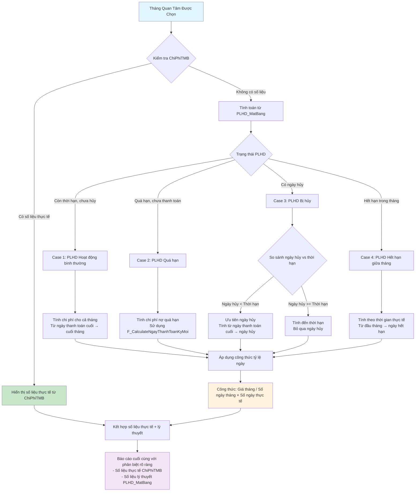

# Báo Cáo Thống Kê Chi Phí Trích Trước

## Mô Tả Tổng Quan

Báo cáo thống kê chi phí trích trước là tính năng cho phép kế toán xem chi phí dự kiến phải trả trong một tháng cụ thể. Hệ thống sẽ ưu tiên hiển thị số liệu thực tế đã ghi nhận trong bảng ChiPhiTMB, và chỉ tính toán lý thuyết từ PLHD_MatBang khi không có số liệu thực tế.

## Yêu Cầu Chính

Dựa trên phân tích từ chat history và yêu cầu nghiệp vụ:

### 1. Chi Phí Từ PLHD Còn Thời Hạn
- Các PLHD_MatBang còn thời hạn, chưa hủy, chạy đến tháng quan tâm
- Chỉ tính phần chạy ngang tháng quan tâm được chọn
- Tính từ ngày thanh toán cuối cùng đến tháng muốn trích

### 2. Chi Phí Từ PLHD Quá Hạn  
- Các hợp đồng quá hạn chưa thanh toán (chưa chuyển và đã chuyển nhưng chưa duyệt)
- Sử dụng function F_CalculateNgayThanhToanKyMoi để tính toán

### 3. Logic Ưu Tiên Dữ Liệu
- **Ưu tiên 1:** Kiểm tra số liệu thực tế trong ChiPhiTMB
- **Ưu tiên 2:** Tính toán lý thuyết từ PLHD_MatBang nếu không có số liệu thực tế

### 4. Công Thức Tính Toán
- Lấy giá cả tháng chia cho số ngày thực tế tháng đó
- Nhân với số ngày còn thời hạn thực tế
- Ngày hủy PLHĐ ưu tiên cao hơn thời hạn

## Đồ Thị Logic Flow



## Biểu Đồ Timeline - Các Trường Hợp PLHD_MatBang

```
Timeline 3 Tháng: T-1 ──────── T (Quan Tâm) ──────── T+1

Tháng:    │    T-1    │      T      │    T+1    │
Ngày:     1────────31│32─────────62│63────────93

Case 1 - PLHD Bình Thường:
          ████████████│██████████████│████████████
          ─────── TT cuối (25)       │
                      │◄─ Chi phí tính ─►│

Case 2 - PLHD Quá Hạn:
          ████████████│██████████████│████████████
          ── TT cuối (F_Calc) (20)   │
                      │◄─ Nợ quá hạn ─►│

Case 3A - PLHD Hủy Giữa T:
          ████████████│████████╫     │
          ─────── TT cuối (28)       │
                      │◄─ Đến hủy ─►│ (50)

Case 3B - PLHD Hủy Đầu T+1:
          ████████████│██████████████│╫
          ─────── TT cuối (22)       │
                      │◄─ Cả tháng T ─►│ Hủy (65)

Case 4 - PLHD Hết Hạn Giữa T:
          ████████████│███████████╫  │
          ─────── TT cuối (26)       │
                      │◄─ Đến hết hạn ─►│ (55)

Case 5 - PLHD Bắt Đầu Giữa T:
                      │    ████████████│████████████
                      │    Ký mới (40) │
                      │    ◄─ Từ giữa T ─►│

═══════════════════════════════════════════════════════
Vùng Thu Thập:        │◄═══════════════►│
                      │   CHI PHÍ THÁNG T   │
═══════════════════════════════════════════════════════

Chú thích:
████ = Hoạt động/Chi phí được tính
╫    = Điểm hủy/hết hạn
TT   = Thanh toán
```

## Giải Thích Timeline Chi Tiết (3 Tháng)

### Khung Thời Gian Tổng Quan
- **Tháng T-1:** Ngày 1-31 (context trước đó)
- **Tháng T (Quan Tâm):** Ngày 32-62 (vùng tính chi phí)
- **Tháng T+1:** Ngày 63-93 (context sau đó)
- **Ranh giới:** Ngày 31/32 và 62/63 đánh dấu chuyển tháng

### Case 1: PLHD Hoạt động bình thường
- **T-1:** `Hoạt động bình thường ──── Ngày TT cuối (25)`
- **T:** `Chi phí được tính (32-62) ████████████████████████████████`
- **T+1:** `Tiếp tục hoạt động ────────────────────────────────`
- **Chi phí tính:** Toàn bộ tháng T từ ngày thanh toán cuối T-1
- **Công thức:** `Giá_tháng × (30/31)` ngày

### Case 2: PLHD Quá hạn
- **T-1:** `Quá hạn từ trước ──── Ngày TT cuối (F_Calc) (20)`
- **T:** `Chi phí nợ quá hạn (32-62) ████████████████████████████████` (đỏ)
- **T+1:** `Vẫn nợ tiếp ────────────────────────────────` (đỏ)
- **Đặc biệt:** Sử dụng `F_CalculateNgayThanhToanKyMoi` để xác định điểm bắt đầu
- **Ưu tiên cao:** Cần xử lý trước các PLHD bình thường

### Case 3A: PLHD Hủy giữa tháng T
- **T-1:** `Hoạt động bình thường ──── Ngày TT cuối (28)`
- **T:** `Chi phí đến hủy (32-50) ██████████████████ ╫ Ngày hủy (50)`
- **T+1:** `Không hoạt động ────────────────────────────────` (xám)
- **Chi phí tính:** Chỉ từ đầu tháng T đến ngày hủy
- **Công thức:** `Giá_tháng × (18/31)` ngày

### Case 3B: PLHD Hủy đầu tháng T+1
- **T-1:** `Hoạt động bình thường ──── Ngày TT cuối (22)`
- **T:** `Chi phí cả tháng T (32-62) ████████████████████████████████`
- **T+1:** `Hủy (65) ╫ Không hoạt động ──────────────────────`
- **Chi phí tính:** Toàn bộ tháng T vì hủy sau tháng quan tâm
- **Công thức:** `Giá_tháng × (30/31)` ngày

### Case 4: PLHD Hết hạn giữa tháng T
- **T-1:** `Hoạt động bình thường ──── Ngày TT cuối (26)`
- **T:** `Chi phí đến hết hạn (32-55) ███████████████████████ ╫ Hết hạn (55)`
- **T+1:** `Hết hạn, không hoạt động ────────────────────────────────` (xám)
- **Chi phí tính:** Từ đầu tháng T đến ngày hết hạn thực tế
- **Công thức:** `Giá_tháng × (23/31)` ngày

### Case 5: PLHD Bắt đầu giữa tháng T (Mới thêm)
- **T-1:** `Chưa có hợp đồng ────────────────────────────────` (xám)
- **T:** `Ký mới (40) ── Chi phí từ giữa T (40-62) ██████████████████`
- **T+1:** `Tiếp tục hoạt động ────────────────────────────────`
- **Chi phí tính:** Từ ngày ký hợp đồng đến hết tháng T
- **Công thức:** `Giá_tháng × (22/31)` ngày

### Vùng Thu Thập Chi Phí Tháng T
- **Phạm vi:** Ngày 32-62 (tháng T quan tâm)
- **Màu đỏ (Critical):** Các đoạn chi phí quá hạn, ưu tiên cao
- **Màu xanh (Active):** Các đoạn chi phí bình thường
- **Kết quả:** Tổng hợp tất cả đoạn chi phí màu đỏ + xanh trong vùng tháng T

### Lợi Ích Timeline 3 Tháng
1. **Context rõ ràng:** Thấy được PLHD hoạt động như thế nào trước và sau tháng T
2. **Điểm chuyển tiếp:** Hiểu rõ các milestone quan trọng (ngày thanh toán cuối, ngày hủy, hết hạn)
3. **Tính liên tục:** Thấy được tính liên tục của các PLHD qua các tháng
4. **Validation logic:** Dễ dàng kiểm tra logic tính toán có hợp lý không

### Kết Quả Tổng Hợp
Tất cả các đoạn chi phí từ các case trên sẽ được cộng lại để tạo thành tổng chi phí trích trước cho tháng T.

## Chi Tiết Các Trường Hợp

### Case 1: PLHD Hoạt động bình thường
- **Điều kiện:** Còn thời hạn, chưa hủy, chạy xuyên suốt tháng quan tâm
- **Tính toán:** Chi phí cho cả tháng từ ngày thanh toán cuối cùng đến cuối tháng
- **Công thức:** `Giá_tháng × 1` (toàn bộ tháng)

### Case 2: PLHD Quá hạn  
- **Điều kiện:** Đã quá thời hạn nhưng chưa thanh toán
- **Tính toán:** Sử dụng `F_CalculateNgayThanhToanKyMoi` để xác định kỳ thanh toán
- **Bao gồm:** Hợp đồng chưa chuyển + đã chuyển nhưng chưa duyệt

### Case 3: PLHD Bị hủy
- **Điều kiện:** Có ngày hủy trong hoặc trước tháng quan tâm  
- **Logic ưu tiên:** Ngày hủy > Thời hạn hợp đồng
- **Tính toán:** Từ ngày thanh toán cuối cùng đến ngày hủy
- **Công thức:** `Giá_tháng / Số_ngày_tháng × Số_ngày_từ_thanh_toán_đến_hủy`

### Case 4: PLHD Hết hạn giữa tháng
- **Điều kiện:** Thời hạn hợp đồng kết thúc trong tháng quan tâm
- **Tính toán:** Theo thời gian thực tế từ đầu tháng đến ngày hết hạn
- **Công thức:** `Giá_tháng / Số_ngày_tháng × Số_ngày_từ_đầu_tháng_đến_hết_hạn`

## Công Nghệ Sử Dụng

### Database Functions
- **F_CalculateNgayThanhToanKyMoi:** Tính toán ngày cuối của một đợt thanh toán tính từ ngày bắt đầu
- **sp_GetHD_ThanhToan_DaCoChungTu_RBAC:** Stored procedure tham khảo cho logic nghiệp vụ

### Tables Chính
- **PLHD_MatBang:** Chứa thông tin phụ lục hợp đồng mặt bằng
- **ChiPhiTMB:** Bảng chi phí thuê mặt bằng (số liệu thực tế đã ghi nhận)

### Logic Tích Hợp
```sql
-- Sử dụng CROSS APPLY với function
CROSS APPLY dbo.F_CalculateNgayThanhToanKyMoi(
    a.ngaythanhtoan_plhd, 
    d.SoHD_PLHD, 
    d.DenNgay
) f
```

## Kết Quả Mong Đợi

Báo cáo sẽ cung cấp:
1. **Danh sách chi tiết** các PLHD với chi phí dự kiến
2. **Phân loại rõ ràng** giữa số liệu thực tế và lý thuyết  
3. **Tổng hợp chi phí** theo từng loại hợp đồng
4. **Ghi chú** về phương pháp tính toán cho từng dòng
5. **Linh hoạt thời gian** - có thể xem mọi tháng (quá khứ, hiện tại, tương lai)
