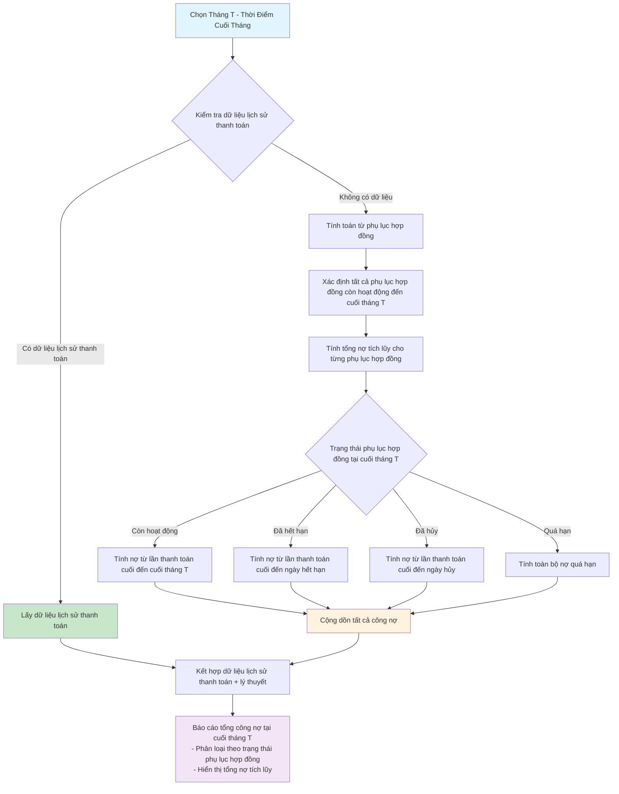
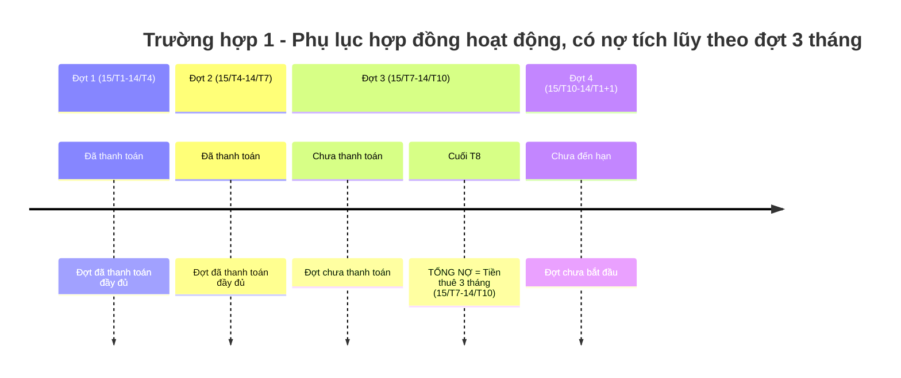
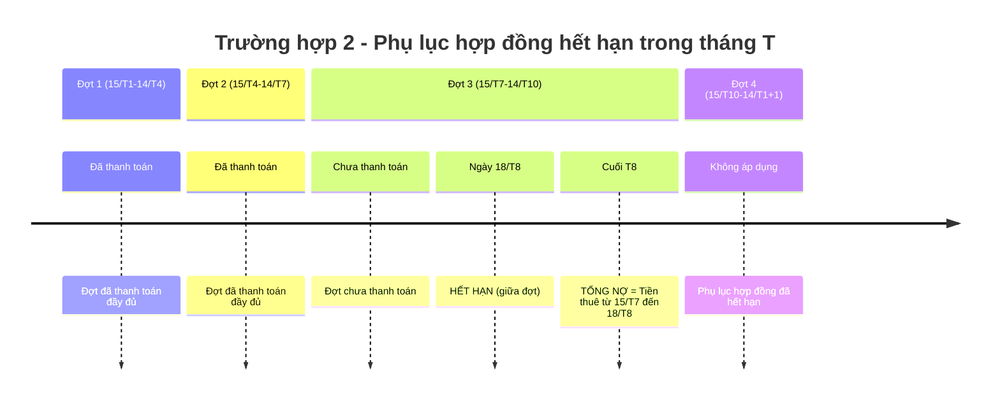
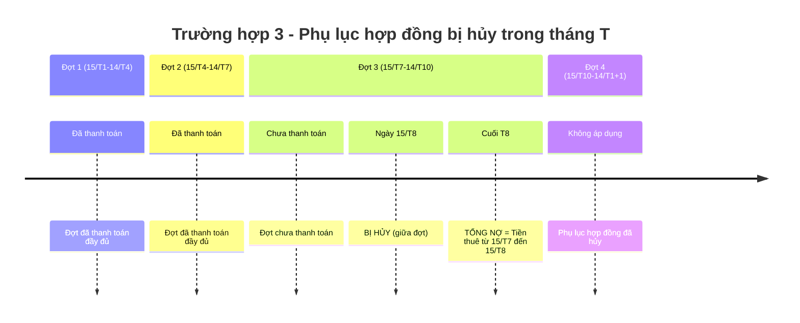
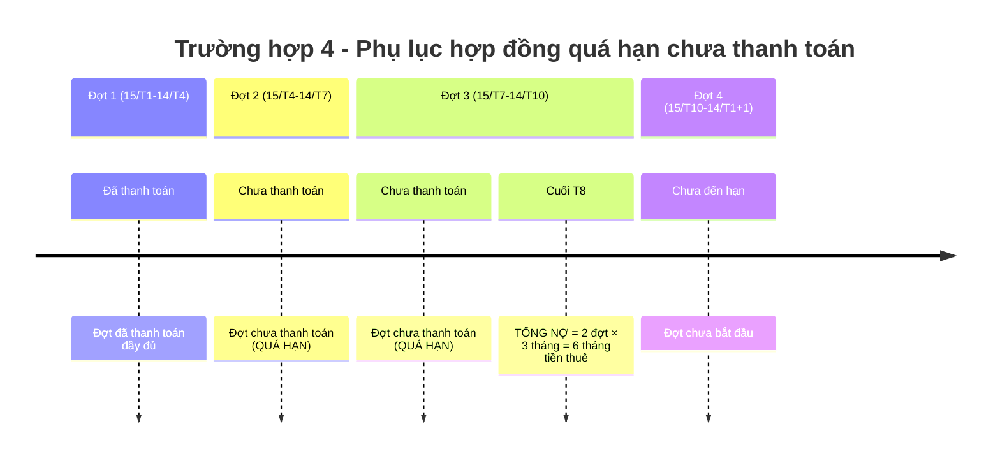

# Báo Cáo Thống Kê Công Nợ Tích Lũy

## Mô Tả Tổng Quan

Báo cáo thống kê công nợ tích lũy là tính năng cho phép kế toán xem **tổng số tiền nợ chưa thanh toán** tại **thời điểm cuối tháng** được chọn. Khác với cách hiểu cũ (tính chi phí phát sinh TRONG tháng), cách hiểu mới này **nhìn ngược về trước** từ cuối tháng để thống kê tổng công nợ tích lũy đến thời điểm đó.

### Đặc Điểm Thanh Toán Thực Tế
- **Chu kỳ thanh toán phổ biến:** Theo đợt 3 tháng (không phải hàng tháng)
- **Ngày bắt đầu đợt:** Có thể là ngày bất kỳ trong tháng (không nhất thiết ngày 1)
- **Ví dụ đợt bắt đầu ngày 15:**
  - Đợt 1: 15/T1 → 14/T4 (3 tháng)
  - Đợt 2: 15/T4 → 14/T7 (3 tháng)
  - Đợt 3: 15/T7 → 14/T10 (3 tháng)
  - Đợt 4: 15/T10 → 14/T1+1 (3 tháng)
- **Tính nợ:** Nếu đợt 3 tháng chưa thanh toán → nợ cả đợt đó
- **Thời điểm báo cáo:** Cuối tháng bất kỳ, xem tổng nợ tích lũy đến thời điểm đó

## Sự Khác Biệt Cơ Bản

### Cách Hiểu Cũ (Period of Time)
- Tháng chọn = **Khung thời gian**
- Tính chi phí **phát sinh TRONG** tháng T
- Logic: "Tháng này tôi phải trả bao nhiêu?"

### Cách Hiểu Mới (Point of Time) - ĐÃ CHỌN
- Tháng chọn = **Thời điểm cuối tháng**
- Tính tổng nợ **tích lũy ĐẾN** cuối tháng T
- Logic: "Đến cuối tháng này, tôi còn nợ tổng cộng bao nhiêu?"

## Yêu Cầu Chính

### 1. Thống Kê Công Nợ Tích Lũy Theo Đợt
- Tính tổng số tiền chưa thanh toán của tất cả phụ lục hợp đồng đến cuối tháng được chọn
- **Đặc biệt:** Thanh toán theo đợt 3 tháng, nên nợ thường tích lũy theo từng đợt
- Bao gồm cả nợ cũ từ các đợt trước và nợ phát sinh trong đợt hiện tại
- Không phân biệt nợ phát sinh khi nào, chỉ quan tâm tổng nợ tại thời điểm cuối tháng

### 2. Logic Ưu Tiên Dữ Liệu
- **Ưu tiên 1:** Kiểm tra dữ liệu lịch sử thanh toán đã ghi nhận
- **Ưu tiên 2:** Tính toán lý thuyết từ phụ lục hợp đồng nếu không có dữ liệu lịch sử thanh toán

### 3. Công Thức Tính Toán Theo Đợt 3 Tháng
- Tính tổng số tiền từ đợt thanh toán cuối cùng đến cuối tháng được chọn
- Cộng dồn tất cả các đợt chưa thanh toán đến thời điểm cuối tháng
- **Ví dụ:** Nếu đợt T4-T6 chưa thanh toán và đang ở cuối T5 → nợ = tiền thuê 3 tháng (T4+T5+T6)

## Đồ Thị Logic Flow

## Các Trường Hợp Chi Tiết

### Trường Hợp 1: Phụ Lục Hợp Đồng Hoạt Động Bình Thường

**Điều kiện:**
- Phụ lục hợp đồng còn hoạt động đến cuối tháng T (ví dụ T8)
- Có đợt thanh toán 3 tháng chưa thực hiện (15/T7-14/T10)
- Phụ lục hợp đồng chưa hết hạn

**Tính toán:**
- Tổng nợ = Tất cả các đợt 3 tháng chưa thanh toán đến cuối tháng T
- **Ví dụ cụ thể:** Đang ở cuối T8, đợt 15/T7-14/T10 chưa thanh toán → Nợ = Tiền thuê × 3 tháng

---

### Trường Hợp 2: Phụ Lục Hợp Đồng Hết Hạn Trong Tháng T

**Điều kiện:**
- Phụ lục hợp đồng hết hạn trong tháng T (ví dụ 18/T8)
- Hết hạn có thể rơi vào giữa một đợt 3 tháng

**Tính toán:**
- Tổng nợ = Nợ tích lũy đến ngày hết hạn, tính theo tỷ lệ trong đợt 3 tháng
- **Ví dụ cụ thể:** Đợt 15/T7-14/T10 chưa thanh toán, hết hạn 18/T8 → Nợ = Tiền thuê × (thời gian từ 15/T7 đến 18/T8) / 3 tháng

---

### Trường Hợp 3: Phụ Lục Hợp Đồng Bị Hủy Trong Tháng T

**Điều kiện:**
- Phụ lục hợp đồng bị hủy trong tháng T (ví dụ 15/T8)
- Hủy có thể rơi vào giữa một đợt 3 tháng

**Tính toán:**
- Tổng nợ = Nợ tích lũy đến ngày hủy, tính theo tỷ lệ trong đợt 3 tháng
- **Ví dụ cụ thể:** Đợt 15/T7-14/T10 chưa thanh toán, hủy 15/T8 → Nợ = Tiền thuê × (thời gian từ 15/T7 đến 15/T8) / 3 tháng

---

### Trường Hợp 4: Phụ Lục Hợp Đồng Quá Hạn

**Điều kiện:**
- Phụ lục hợp đồng đã quá thời hạn thanh toán nhiều đợt
- Chưa thanh toán (chưa chuyển hoặc đã chuyển nhưng chưa duyệt)

**Tính toán:**
- Tổng nợ = Toàn bộ các đợt 3 tháng chưa thanh toán
- Ưu tiên cao trong báo cáo (hiển thị nổi bật)
- **Ví dụ cụ thể:** 2 đợt quá hạn (15/T4-14/T7, 15/T7-14/T10) → Nợ = Tiền thuê × 6 tháng

## Ví Dụ Thực Tế Chu Kỳ Thanh Toán

**Trường hợp 1: Phụ lục hợp đồng bắt đầu ngày 1 (truyền thống):**
- **Đợt 1:** 01/T1 → 31/T3 (Quý 1) - Thanh toán vào cuối T3
- **Đợt 2:** 01/T4 → 30/T6 (Quý 2) - Thanh toán vào cuối T6  
- **Đợt 3:** 01/T7 → 30/T9 (Quý 3) - Thanh toán vào cuối T9
- **Đợt 4:** 01/T10 → 31/T12 (Quý 4) - Thanh toán vào cuối T12

**Trường hợp 2: Phụ lục hợp đồng bắt đầu ngày 15 (thực tế phổ biến):**
- **Đợt 1:** 15/T1 → 14/T4 (3 tháng) - Thanh toán vào 14/T4
- **Đợt 2:** 15/T4 → 14/T7 (3 tháng) - Thanh toán vào 14/T7
- **Đợt 3:** 15/T7 → 14/T10 (3 tháng) - Thanh toán vào 14/T10
- **Đợt 4:** 15/T10 → 14/T1+1 (3 tháng) - Thanh toán vào 14/T1+1

**Tình huống báo cáo tại cuối T8 (trường hợp 2):**
- Đợt 1 (15/T1-14/T4): ✅ Đã thanh toán
- Đợt 2 (15/T4-14/T7): ✅ Đã thanh toán  
- Đợt 3 (15/T7-14/T10): ❌ Chưa thanh toán → **NỢ = Tiền thuê 3 tháng**
- Đợt 4 (15/T10-14/T1+1): ⏳ Chưa đến hạn
