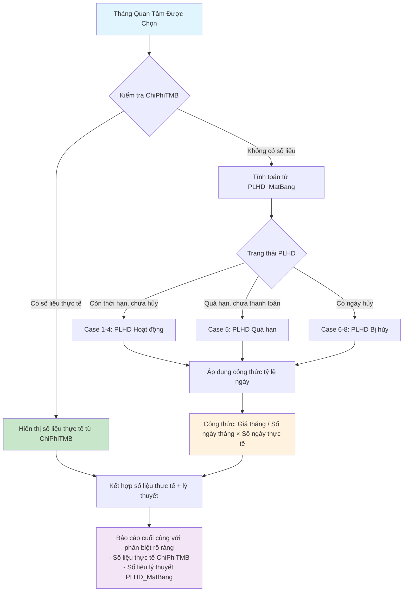

# Báo Cáo Thống Kê Chi Phí Trích Trước

## Mô Tả Tổng Quan

Báo cáo thống kê chi phí trích trước là tính năng cho phép kế toán xem chi phí dự kiến phải trả trong một tháng cụ thể. Hệ thống sẽ ưu tiên hiển thị số liệu thực tế đã ghi nhận trong bảng ChiPhiTMB, và chỉ tính toán lý thuyết từ PLHD_MatBang khi không có số liệu thực tế.

## Yêu Cầu Chính

### 1. Chi Phí Từ PLHD Còn Thời Hạn
- Các PLHD_MatBang còn thời hạn, chưa hủy, chạy đến tháng quan tâm
- Chỉ tính phần chạy ngang tháng quan tâm được chọn
- Tính từ ngày thanh toán cuối cùng đến tháng muốn trích

### 2. Chi Phí Từ PLHD Quá Hạn  
- Các hợp đồng quá hạn chưa thanh toán (chưa chuyển và đã chuyển nhưng chưa duyệt)
- Sử dụng function F_CalculateNgayThanhToanKyMoi để tính toán

### 3. Logic Ưu Tiên Dữ Liệu
- **Ưu tiên 1:** Kiểm tra số liệu thực tế trong ChiPhiTMB
- **Ưu tiên 2:** Tính toán lý thuyết từ PLHD_MatBang nếu không có số liệu thực tế

### 4. Công Thức Tính Toán
- Lấy giá cả tháng chia cho số ngày thực tế tháng đó
- Nhân với số ngày còn thời hạn thực tế
- Ngày hủy PLHĐ ưu tiên cao hơn thời hạn

## Đồ Thị Logic Flow Tổng Quan



## Các Trường Hợp Chi Tiết (Timeline Cases)

### Case 1: PLHD Hoạt động bình thường - Thanh toán cuối trong tháng T

```mermaid
gantt
    title Case 1 - PLHD Hoạt động bình thường (TT cuối trong tháng T)
    dateFormat X
    axisFormat %d
    
    section Tháng T-1
    Hoạt động bình thường    :done, prev-month, 1, 30d
    
    section Tháng T (Quan Tâm)
    Ngày TT cuối            :milestone, payment-date, 35, 0d
    Chi phí được tính       :active, cost-period, 35, 27d
    
    section Tháng T+1
    Tiếp tục hoạt động      :future, next-month, 63, 30d
```

**Điều kiện:**
- Ngày thanh toán cuối cùng (từ vw_ChiPhiTMBMoiNhat) nằm trong tháng T
- Không có ngày hủy (ngayhuy_plhd IS NULL)
- Thời hạn (thoihanplhd) > cuối tháng T

**Tính toán:**
- Từ ngày thanh toán cuối đến cuối tháng T
- Công thức: `Giá_tháng × (Số_ngày_từ_TT_cuối_đến_cuối_tháng / Số_ngày_tháng_T)`

---

### Case 2: PLHD Hoạt động bình thường - Thanh toán cuối trước tháng T

```mermaid
gantt
    title Case 2 - PLHD Hoạt động bình thường (TT cuối trước tháng T)
    dateFormat X
    axisFormat %d
    
    section Tháng T-1
    Hoạt động bình thường    :done, prev-month, 1, 25d
    Ngày TT cuối            :milestone, payment-date, 25, 0d
    Chưa thanh toán         :active, unpaid, 25, 6d
    
    section Tháng T (Quan Tâm)
    Chi phí cả tháng        :active, cost-period, 32, 30d
    
    section Tháng T+1
    Tiếp tục hoạt động      :future, next-month, 63, 30d
```

**Điều kiện:**
- Ngày thanh toán cuối cùng < đầu tháng T
- Không có ngày hủy (ngayhuy_plhd IS NULL)
- Thời hạn (thoihanplhd) > cuối tháng T

**Tính toán:**
- Chi phí cho toàn bộ tháng T
- Công thức: `Giá_tháng × 1`

---

### Case 3: PLHD Hết hạn trong tháng T - Thanh toán cuối trước tháng T

```mermaid
gantt
    title Case 3 - PLHD Hết hạn trong tháng T (TT cuối trước tháng T)
    dateFormat X
    axisFormat %d
    
    section Tháng T-1
    Hoạt động bình thường    :done, prev-month, 1, 25d
    Ngày TT cuối            :milestone, payment-date, 25, 0d
    Chưa thanh toán         :active, unpaid, 25, 6d
    
    section Tháng T (Quan Tâm)
    Chi phí đến hết hạn     :active, cost-period, 32, 18d
    Ngày hết hạn            :milestone, expire-date, 50, 0d
    Hết hạn                 :done, expired, 50, 12d
    
    section Tháng T+1
    Không hoạt động         :expired-inactive, 63, 30d
```



**Điều kiện:**
- Ngày thanh toán cuối cùng < đầu tháng T
- Không có ngày hủy (ngayhuy_plhd IS NULL)
- Thời hạn (thoihanplhd) nằm trong tháng T

**Tính toán:**
- Từ đầu tháng T đến ngày hết hạn
- Công thức: `Giá_tháng × (Số_ngày_từ_đầu_tháng_T_đến_hết_hạn / Số_ngày_tháng_T)`

---

### Case 4: PLHD Hết hạn trong tháng T - Thanh toán cuối trong tháng T


**Điều kiện:**
- Ngày thanh toán cuối cùng nằm trong tháng T
- Không có ngày hủy (ngayhuy_plhd IS NULL)
- Thời hạn (thoihanplhd) nằm trong tháng T và > ngày thanh toán cuối

**Tính toán:**
- Từ ngày thanh toán cuối đến ngày hết hạn
- Công thức: `Giá_tháng × (Số_ngày_từ_TT_cuối_đến_hết_hạn / Số_ngày_tháng_T)`

---

### Case 5: PLHD Quá hạn chưa thanh toán

```mermaid
gantt
    title Case 5 - PLHD Quá hạn chưa thanh toán
    dateFormat X
    axisFormat %d
    
    section Tháng T-1
    Hoạt động               :done, prev-month, 1, 20d
    Ngày TT cuối (F_Calc)   :milestone, payment-calc, 20, 0d
    Quá hạn                 :crit, overdue, 20, 11d
    
    section Tháng T (Quan Tâm)
    Chi phí nợ quá hạn      :crit, overdue-cost, 32, 30d
    
    section Tháng T+1
    Vẫn nợ                  :crit, still-overdue, 63, 30d
```



**Điều kiện:**
- PLHD đã quá thời hạn thanh toán
- Chưa thanh toán (chưa chuyển hoặc đã chuyển nhưng chưa duyệt)
- Sử dụng F_CalculateNgayThanhToanKyMoi để xác định ngày thanh toán cuối

**Tính toán:**
- Chi phí nợ quá hạn cho tháng T
- Ưu tiên cao trong báo cáo (màu đỏ)
- Công thức: `Giá_tháng × 1` (toàn bộ tháng)

---

### Case 6: PLHD Bị hủy trong tháng T - Thanh toán cuối trước tháng T


**Điều kiện:**
- Ngày thanh toán cuối cùng < đầu tháng T
- Có ngày hủy (ngayhuy_plhd) nằm trong tháng T
- Ngày hủy ưu tiên cao hơn thời hạn

**Tính toán:**
- Từ đầu tháng T đến ngày hủy
- Công thức: `Giá_tháng × (Số_ngày_từ_đầu_tháng_T_đến_ngày_hủy / Số_ngày_tháng_T)`

---

### Case 7: PLHD Bị hủy trong tháng T - Thanh toán cuối trong tháng T

```mermaid
gantt
    title Case 7 - PLHD Bị hủy trong tháng T (TT cuối trong tháng T)
    dateFormat X
    axisFormat %d
    
    section Tháng T-1
    Hoạt động bình thường    :done, prev-month, 1, 30d
    
    section Tháng T (Quan Tâm)
    Ngày TT cuối            :milestone, payment-date, 35, 0d
    Chi phí đến ngày hủy    :active, cost-period, 35, 15d
    Ngày hủy                :milestone, cancel-date, 50, 0d
    Đã hủy                  :done, cancelled, 50, 12d
    
    section Tháng T+1
    Không hoạt động         :cancelled-inactive, 63, 30d
```



**Điều kiện:**
- Ngày thanh toán cuối cùng nằm trong tháng T
- Có ngày hủy (ngayhuy_plhd) nằm trong tháng T và > ngày thanh toán cuối
- Ngày hủy ưu tiên cao hơn thời hạn

**Tính toán:**
- Từ ngày thanh toán cuối đến ngày hủy
- Công thức: `Giá_tháng × (Số_ngày_từ_TT_cuối_đến_ngày_hủy / Số_ngày_tháng_T)`

---

### Case 8: PLHD Bị hủy sau tháng T

```mermaid
gantt
    title Case 8 - PLHD Bị hủy sau tháng T
    dateFormat X
    axisFormat %d
    
    section Tháng T-1
    Hoạt động bình thường    :done, prev-month, 1, 25d
    Ngày TT cuối            :milestone, payment-date, 25, 0d
    Chưa thanh toán         :active, unpaid, 25, 6d
    
    section Tháng T (Quan Tâm)
    Chi phí cả tháng        :active, cost-period, 32, 30d
    
    section Tháng T+1
    Ngày hủy                :milestone, cancel-date, 65, 0d
    Đã hủy                  :done, cancelled, 65, 28d
```



**Điều kiện:**
- Ngày thanh toán cuối cùng < đầu tháng T
- Có ngày hủy (ngayhuy_plhd) > cuối tháng T
- Vẫn phải tính chi phí cho tháng T vì hủy sau đó

**Tính toán:**
- Chi phí cho toàn bộ tháng T
- Công thức: `Giá_tháng × 1`

---

## Tổng Hợp Logic Tính Toán

### Yếu Tố Tham Gia Tổ Hợp
1. **Tháng T quan tâm:** Tháng được chọn để tính chi phí trích trước
2. **Ngày thanh toán cuối cùng:** Từ vw_ChiPhiTMBMoiNhat
3. **Ngày hủy (ngayhuy_plhd):** Có thể NULL, ưu tiên cao hơn thời hạn
4. **Thời hạn (thoihanplhd):** Ngày hết hạn của PLHD

### Ma Trận Tổ Hợp Cases

| Case | TT Cuối | Ngày Hủy | Thời Hạn | Tính Chi Phí |
|------|---------|-----------|-----------|--------------|
| 1 | Trong T | NULL | > Cuối T | TT cuối → Cuối T |
| 2 | < Đầu T | NULL | > Cuối T | Cả tháng T |
| 3 | < Đầu T | NULL | Trong T | Đầu T → Hết hạn |
| 4 | Trong T | NULL | Trong T | TT cuối → Hết hạn |
| 5 | F_Calc | NULL | < Đầu T | Quá hạn cả tháng |
| 6 | < Đầu T | Trong T | Bất kỳ | Đầu T → Ngày hủy |
| 7 | Trong T | Trong T | Bất kỳ | TT cuối → Ngày hủy |
| 8 | < Đầu T | > Cuối T | Bất kỳ | Cả tháng T |

### Công Nghệ Sử Dụng

#### Database Functions
- **F_CalculateNgayThanhToanKyMoi:** Tính toán ngày cuối của một đợt thanh toán
- **sp_GetHD_ThanhToan_DaCoChungTu_RBAC:** Stored procedure tham khảo

#### Tables Chính
- **PLHD_MatBang:** Chứa thông tin phụ lục hợp đồng mặt bằng
- **ChiPhiTMB:** Bảng chi phí thuê mặt bằng (số liệu thực tế)
- **vw_ChiPhiTMBMoiNhat:** View lấy ngày thanh toán cuối cùng

#### Logic Tích Hợp
```sql
-- Sử dụng CROSS APPLY với function
CROSS APPLY dbo.F_CalculateNgayThanhToanKyMoi(
    a.ngaythanhtoan_plhd, 
    d.SoHD_PLHD, 
    d.DenNgay
) f
```

## Kết Quả Mong Đợi

Báo cáo sẽ cung cấp:
1. **Danh sách chi tiết** các PLHD với chi phí dự kiến theo từng case
2. **Phân loại rõ ràng** giữa số liệu thực tế và lý thuyết  
3. **Tổng hợp chi phí** theo từng loại hợp đồng và case
4. **Ghi chú case** để hiểu phương pháp tính toán
5. **Linh hoạt thời gian** - có thể xem mọi tháng (quá khứ, hiện tại, tương lai)
6. **Ưu tiên hiển thị** các PLHD quá hạn (Case 5) với màu đỏ
